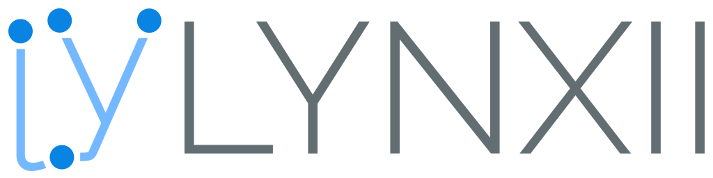

<p align="center">
  
  <h3 align="center">Powerful and Programmable Smart-device Network</h3>
</p>

<p align="center">
  <a href="https://vevox.io/lynxii">
    
  </a>
  <a href="https://travis-ci.org/VevoxDigital/Lynxii">
    
  </a>
  <a href="https://codeclimate.com/github/VevoxDigital/Lynxii">
    
  </a>
  <a href="https://codeclimate.com/github/VevoxDigital/Lynxii">
    
  </a>
</p>

----

# Introduction
Lynxii is a powerful tool for creating a dynamic and smarter network of devices; we aim to take the Internet of Things to the next level. At current, many devices are Wi-Fi capable, but can only do so much and usually need proprietary software to control it. On top of that, it's rare the device comes with an automated solution.

Let's say you want your home's sprinklers to come on at certain times of day, but *only* if its not already raining. What about an office with lights that automatically come on when an employee arrives, but only for his/her own department? How's a factory floor that can shut down or power up production lines as incoming orders increase or decrease? All of these can be done with Lynxii, all without any programming knowledge needed.

# Server Installation
## Pre-built
Pre-built packages are not current available in the project's current state.

## Built It Yourself
If you have trouble with the pre-built packages, want to make some changes to your copy, or just want to make it yourself for any other reason, here's how to do it.

**NOTE:** Building Lynxii is not supported on Windows. That's not to say it can't be done, but we due to the way the project is configured and the tools used, we cannot offer you any help if it does not work.

You will need `git`, `nodejs` v10 or later, and `yarn`.

Start by getting everything ready.
```
  # Clone the repository and move to the directory
  git clone https://github.com/VevoxDigital/Lynxii
  cd Lynxii

  # Install the necessary build tools
  yarn global add nyc mocha ts-node

  # Install dependencies
  yarn
```

And now, build it.
```
  # Build it for your current platform
  yarn build

  # Or, build for a specific platform (in this case, 64-bit Windows)
  yarn build-win32-x64
```

# Client Installation
The client GUI is not yet available in the project's current state.

# About
## Data Security
traffic *within* your local network is encrypted over SSL, the same proven technology your browser uses to secure your information on most websites you visit. Additonally, neither Lynxii itself nor any of its included blocks will access the open Internet in any way once installed; the whole thing works with its link to the outside world disabled. The same can't be said about user-installed block libraries, however, and you should check with the authors of those libraries to see what they need.

Bear in mind, Lynxii is a powerful tool and has securities in place to safeguard your data, but it is only as smart as its user. Keep your passwords safe and secure; anyone who can sign in (whether you want them to or not) has full access to edit, delete, and/or monitor both your maps and the data that moves around in them. Furthermore, only add blocks you know and trust; anyone with access to your local network can add a block to the lobby. It's harmless there, but it can cause all kinds of havoc if added to your map.

## Multiple Networks
At current, Lynxii does not support using multiple networks or subnets. This is a feature we have planned and are working on.

## Contributing
Lynxii is still in a very early development stage, so we're eager to hear your feedback. If you want to make some changes of your own to send to us, read over our [contribution guidelines](/doc/contributing.md) then submit a pull request!

----

*Myra ta Hayzel; Pal, Kifitae te Entra en na Loka*

Designed and Developed by @CynicalBusiness with @VevoxDigital

[GNU General Public License v3.0](/LICENSE)
